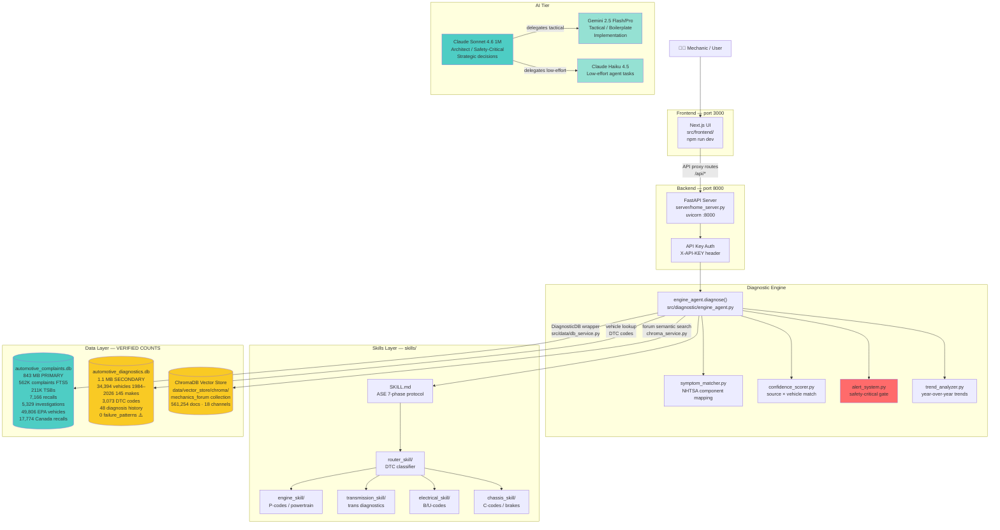
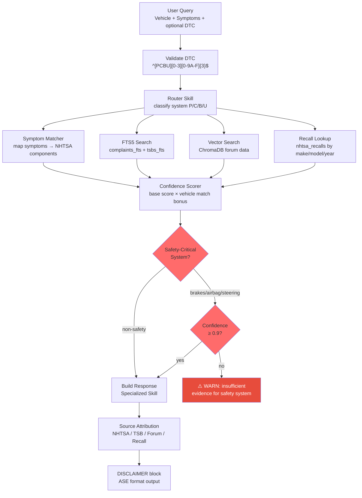
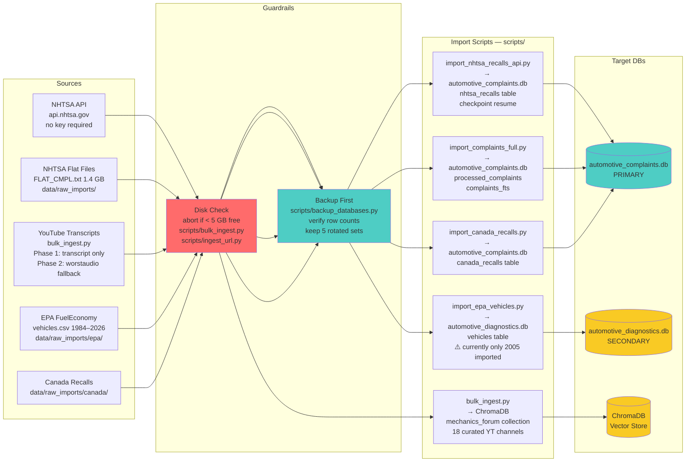
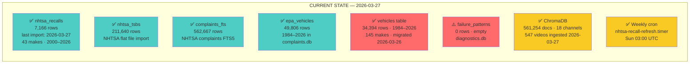
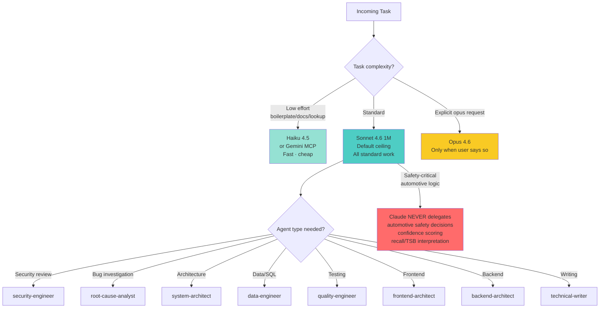
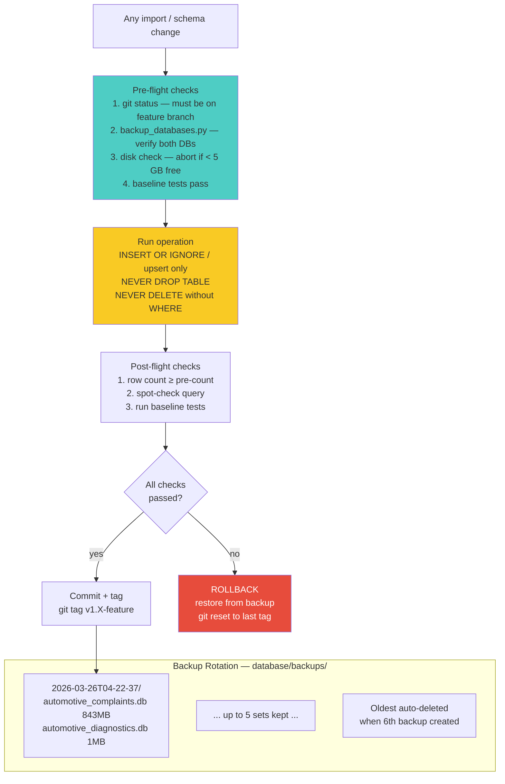
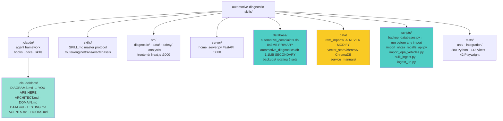

# System Architecture Diagrams

> **GROUND TRUTH — verified 2026-03-26**
> All row counts and paths are runtime-verified against live databases.
> Any agent reading this file should trust these numbers over comments in code.
> If numbers look wrong, run: `sqlite3 database/automotive_complaints.db "SELECT COUNT(*) FROM complaints_fts;"` to re-verify.

---

## 1. High-Level System Architecture

---

## 2. Both Databases — Schema & Relationships

```mermaid
graph TB
    subgraph "automotive_complaints.db  843 MB  PRIMARY"
        direction TB
        CF["complaints_fts\n562,667 rows FTS5\nmake · model · year\ncomponent · summary"]
        NT["nhtsa_tsbs\n211,640 rows\nbulletin_no · make · model\nyear · component · summary"]
        NR["nhtsa_recalls\n7,166 rows\ncampaign_no · make · model\nyear_from/to · summary\nremedy · park_it flag"]
        NI["nhtsa_investigations\n5,329 rows\naction_no · make · model\ncomponent · summary"]
        CR["canada_recalls\n17,774 rows"]
        EV["epa_vehicles\n49,806 rows\nyears 1984–2026\n44 makes"]
        PC["processed_complaints\n1,564,487 rows\nraw NHTSA flat file"]
        TF["tsbs_fts  FTS5 mirror of nhtsa_tsbs"]
        RF["recalls_fts  FTS5 mirror of nhtsa_recalls"]
        NT --> TF
        NR --> RF
        CF -.->|"source data"| PC
    end

    subgraph "automotive_diagnostics.db  1.1 MB  SECONDARY"
        direction TB
        VH["vehicles\n792 rows\n⚠️ 2005 ONLY — gap\nshould be 49K rows 1984–2026"]
        DC["dtc_codes\n3,073 rows\nP/C/B/U codes\nFTS5 enabled"]
        FP["failure_patterns\n0 rows ⚠️ empty\ncommon failure library"]
        DH["diagnosis_history\n48 rows\nper-session records"]
        VF["vehicle_failures  junction"]
        VR["vehicle_recalls  junction"]
        VT["vehicle_tsbs  junction"]
        VH --> VF & VR & VT
        FP --> VF
    end

    subgraph "ChromaDB  data/vector_store/chroma/"
        MF["mechanics_forum collection\n561,254 docs · 18 YT channels\n547 videos ingested 2026-03-27\nbulk_ingest.py"]
    end

    subgraph "Backup — database/backups/"
        BK["Rotating backups\nkeep last 5 sets\n~845 MB per set\nscripts/backup_databases.py"]
    end

    style VH fill:#ff6b6b
    style FP fill:#ff6b6b
    style MF fill:#f9ca24
    style BK fill:#4ecdc4
```

---

## 3. Query Routing — Request to Response

---

## 4. Data Ingestion Pipeline

---

## 5. Data Freshness & Known Gaps

---

## 6. Agent Orchestration & Model Tiers

---

## 7. Backup & Safety Infrastructure

---

## 8. File Structure

---

## Quick Reference for Agents

| Need to know | Go to |
|---|---|
| System overview | Diagram 1 |
| Exact DB table names + row counts | Diagram 2 |
| How a query gets answered | Diagram 3 |
| How data gets into the system | Diagram 4 |
| What's current vs broken | Diagram 5 |
| Which model/agent to use | Diagram 6 |
| Before touching the DB | Diagram 7 |
| File locations | Diagram 8 |

**Critical rules for any agent touching data:**
1. Run `scripts/backup_databases.py` before any import
2. Never use `DROP TABLE` — use `INSERT OR IGNORE` / upsert
3. Never write to `data/raw_imports/`
4. Always verify row counts after import (post ≥ pre)
5. Check disk: abort if < 5 GB free
