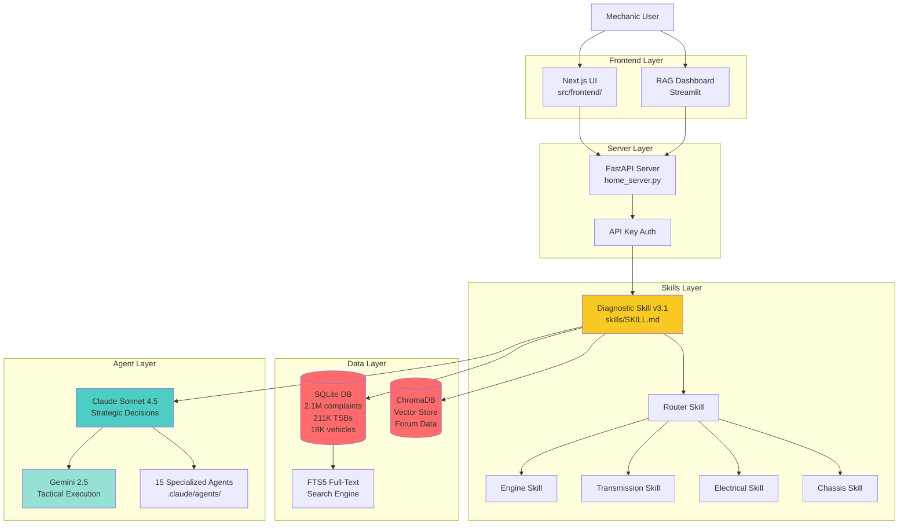
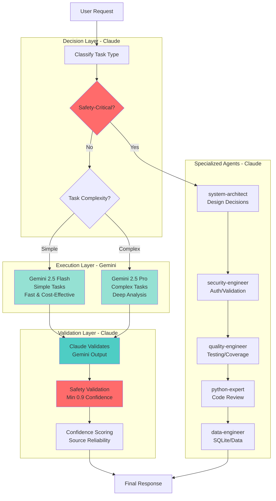
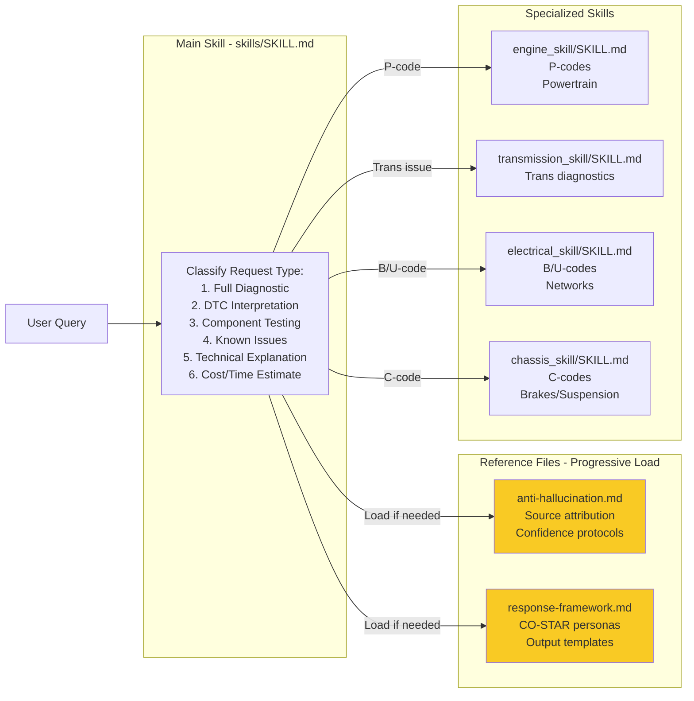
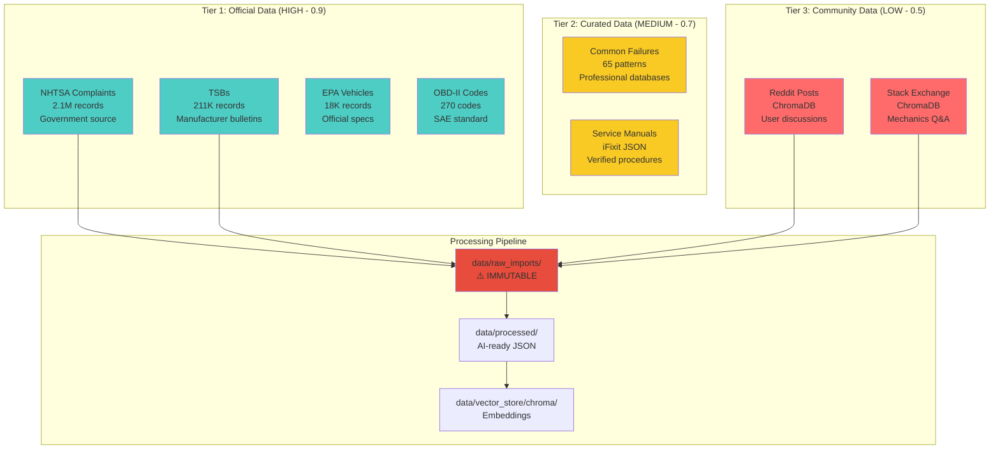
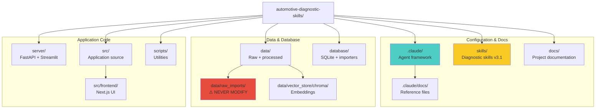
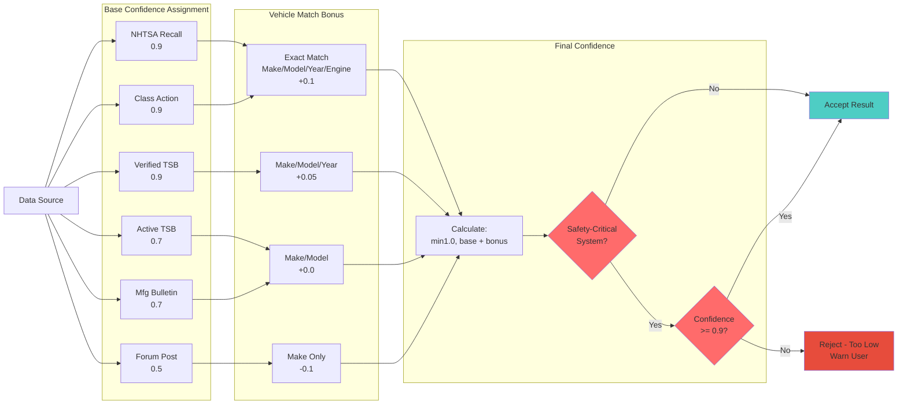

# System Architecture Diagrams

**Purpose**: Visual reference for agents to quickly understand system structure and data flow.

---

## 1. High-Level System Architecture



---

## 2. RAG Pipeline Data Flow

```mermaid
graph LR
    Query[User Query:<br/>Vehicle + Symptoms]

    subgraph "Classification"
        Router[Router Skill<br/>Classify by DTC System]
        ValidateDTC[Validate DTC Code<br/>^[PCBU][0-3][0-9A-F]3$]
    end

    subgraph "Retrieval"
        VectorSearch[Vector Search<br/>ChromaDB<br/>Forum Data]
        SQLSearch[SQL Search<br/>SQLite<br/>NHTSA/TSBs]
        FTS5Search[FTS5 Full-Text<br/>Complaints/TSBs]
    end

    subgraph "Ranking"
        ConfScore[Confidence Scoring<br/>Source Reliability<br/>+ Vehicle Match]
        SafetyCheck[Safety-Critical Check<br/>Brakes/Airbags/Steering<br/>Min 0.9 confidence]
    end

    subgraph "Response Generation"
        SpecSkill[Specialized Skill<br/>Engine/Trans/Elec/Chassis]
        Attribution[Source Attribution<br/>NHTSA/TSB/Forum]
        Warning[Safety Warnings<br/>If applicable]
    end

    Query --> Router
    Query --> ValidateDTC
    Router --> VectorSearch
    Router --> SQLSearch
    Router --> FTS5Search

    VectorSearch --> ConfScore
    SQLSearch --> ConfScore
    FTS5Search --> ConfScore

    ConfScore --> SafetyCheck
    SafetyCheck --> SpecSkill
    SpecSkill --> Attribution
    Attribution --> Warning
    Warning --> Response[Diagnostic Response]

    style SafetyCheck fill:#ff6b6b
    style Warning fill:#ff6b6b
    style ConfScore fill:#f9ca24
```

---

## 3. Database Schema Architecture

```mermaid
graph TB
    subgraph "Core Tables (18K+ records)"
        Vehicles[vehicles<br/>18,607 records<br/>Make/Model/Year/Engine]
        DTCCodes[dtc_codes<br/>270 records<br/>OBD-II Codes]
        FailurePatterns[failure_patterns<br/>65 records<br/>Common Failures]
    end

    subgraph "NHTSA Data (2.3M+ records)"
        Complaints[nhtsa_complaints<br/>2,144,604 records<br/>Owner Complaints]
        TSBs[nhtsa_tsbs<br/>211,640 records<br/>Technical Bulletins]
        Recalls[recalls<br/>Safety Recalls]
    end

    subgraph "Relationship Tables"
        VehicleFailures[vehicle_failures<br/>1,994 links]
        DTCCorrelations[dtc_failure_correlations<br/>DTC → Failure mapping]
        FailureParts[failure_parts<br/>Parts needed]
        VehicleTSBs[vehicle_tsbs<br/>Vehicle → TSB links]
    end

    subgraph "Support Tables"
        Parts[parts<br/>OEM/Aftermarket]
        DiagTests[diagnostic_tests<br/>Procedures]
        ServiceProc[service_procedures<br/>Repair manuals]
    end

    subgraph "Full-Text Search (FTS5)"
        VehicleFTS[vehicles_fts<br/>Virtual Table]
        ComplaintsFTS[complaints_fts<br/>Virtual Table]
        TSBFTS[tsbs_fts<br/>Virtual Table]
        FailureFTS[failure_patterns_fts<br/>Virtual Table]
    end

    Vehicles --> VehicleFailures
    Vehicles --> VehicleTSBs
    Vehicles --> VehicleFTS

    FailurePatterns --> VehicleFailures
    FailurePatterns --> DTCCorrelations
    FailurePatterns --> FailureParts
    FailurePatterns --> FailureFTS

    DTCCodes --> DTCCorrelations

    Parts --> FailureParts

    Complaints --> ComplaintsFTS
    TSBs --> TSBFTS
    TSBs --> VehicleTSBs

    style VehicleFTS fill:#95e1d3
    style ComplaintsFTS fill:#95e1d3
    style TSBFTS fill:#95e1d3
    style FailureFTS fill:#95e1d3
    style Complaints fill:#ff6b6b
    style TSBs fill:#ff6b6b
```



---

## 4. Agent Orchestration Flow



---

## 5. Progressive Disclosure Architecture



---

## 6. Data Source Hierarchy



---

## 7. File Structure Overview



---

## 8. Confidence Scoring Flow



---

## Quick Reference

**When to consult these diagrams**:
- New agent onboarding → Start with Diagram 1 (High-Level Architecture)
- Understanding data flow → Diagram 2 (RAG Pipeline)
- Database queries → Diagram 3 (Database Schema)
- Task delegation → Diagram 4 (Agent Orchestration)
- Skill routing → Diagram 5 (Progressive Disclosure)
- Data integrity → Diagram 6 (Data Source Hierarchy)
- File navigation → Diagram 7 (File Structure)
- Confidence validation → Diagram 8 (Confidence Scoring)

**Related Documentation**:
- @.claude/docs/ARCHITECT.md - Detailed architecture
- @.claude/docs/DOMAIN.md - Automotive domain rules
- @.claude/docs/AGENTS.md - Agent specifications
- @docs/DATABASE_ARCHITECTURE.md - Complete schema details
