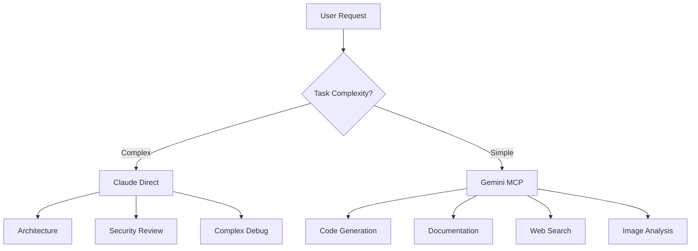

# Gemini MCP - Quick Reference

## 🎯 Tool Selection Guide

| Task Type | Use | Tool |
|-----------|-----|------|
| **Architecture Design** | Claude | Direct conversation |
| **Security Review** | Claude | Direct conversation |
| **Complex Debugging** | Claude | Direct conversation |
| **API Design** | Claude | Direct conversation |
| **UI/UX Design** | Claude | Direct conversation |
| **Simple Code** | Gemini | `mcp__gemini__generate_text` |
| **Documentation** | Gemini | `mcp__gemini__generate_text` |
| **Web Research** | Gemini | `mcp__gemini__generate_text` + grounding |
| **Image Analysis** | Gemini | `mcp__gemini__analyze_image` |
| **Unit Tests** | Gemini | `mcp__gemini__generate_text` |

---

## 📦 Available Gemini Tools

After restarting Claude Code, you'll have these tools available:

```
mcp__gemini__generate_text     - Code, docs, simple tasks
mcp__gemini__analyze_image     - Visual analysis (damage, diagrams)
mcp__gemini__count_tokens      - Token counting
mcp__gemini__list_models       - Available models
mcp__gemini__generate_embeddings - Vector embeddings
mcp__gemini__help              - Tool documentation
```

---

## 🚀 Common Usage Patterns

### 1. Simple Code Generation
```
User: "Generate a Python function to parse OBD codes"
Claude: "I'll use Gemini for this straightforward code task"
→ Calls: mcp__gemini__generate_text
```

### 2. Image Analysis
```
User: "Analyze this wiring diagram"
Claude: "Let me use Gemini's vision capabilities"
→ Calls: mcp__gemini__analyze_image
```

### 3. Web Research
```
User: "What are the latest Ford F-150 recalls?"
Claude: "I'll use Gemini with Google Search grounding"
→ Calls: mcp__gemini__generate_text (with grounding: true)
```

### 4. Documentation
```
User: "Document this diagnostic function"
Claude: "Gemini can handle this documentation task"
→ Calls: mcp__gemini__generate_text
```

---

## ⚙️ Model Selection

| Model | Context | Best For |
|-------|---------|----------|
| `gemini-2.5-pro` | 2M | Complex reasoning, JSON output |
| `gemini-2.5-flash` | 1M | **General use (recommended)** |
| `gemini-2.5-flash-lite` | 1M | Speed-critical tasks |
| `gemini-2.0-flash` | 1M | Standard tasks |
| `gemini-1.5-pro` | 2M | Legacy support |

---

## 🔄 Workflow Example



---

## 💡 Tips

1. **Let Claude Decide**: Claude will automatically route tasks to Gemini when appropriate
2. **Hooks Work**: Gemini calls allow your hooks to fire (unlike Claude's extended thinking)
3. **Cost Savings**: Gemini handles ~60-70% of routine tasks at lower cost
4. **Model Upgrade**: You're getting Gemini 2.5 Pro (newer than 1.5 Pro you specified!)

---

## 🔧 Quick Troubleshooting

| Issue | Solution |
|-------|----------|
| Tools not appearing | Restart Claude Code |
| API errors | Check `.mcp.json` API key |
| Rate limits | Free tier: 60 req/min - add delays |
| Server not starting | Run `npx -y github:aliargun/mcp-server-gemini` manually |

---

## 📋 Next Steps

1. **Restart Claude Code** to load the MCP server
2. **Verify tools** with `/tools` command
3. **Test integration**: "Generate a simple Python function"
4. **Read full docs**: `docs/GEMINI_MCP_SETUP.md`

---

## 🔐 Security Reminder

- ✅ `.mcp.json` is in `.gitignore`
- ✅ API key is secure
- ⚠️ Never commit `.mcp.json`
- ✅ Use `.mcp.json.example` for sharing
